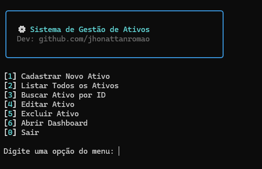
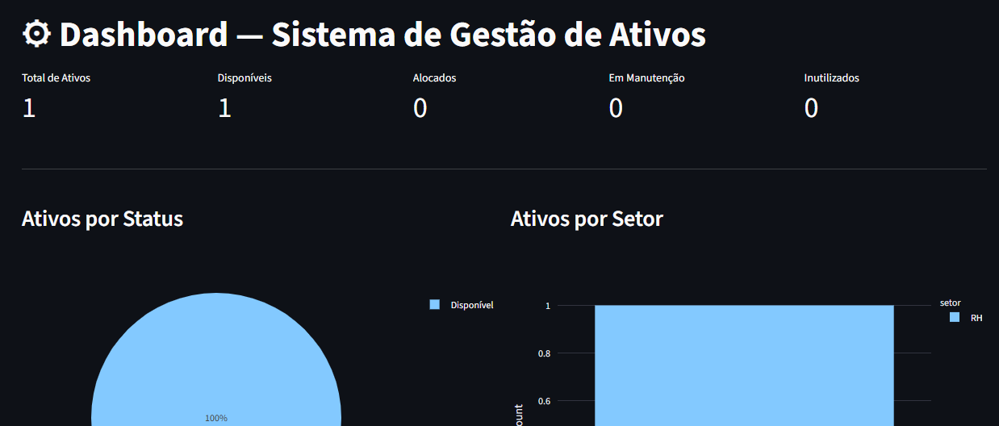
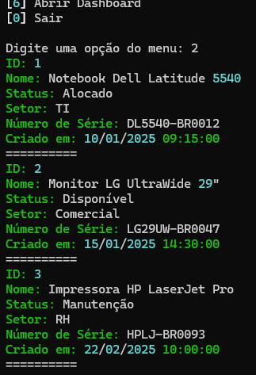
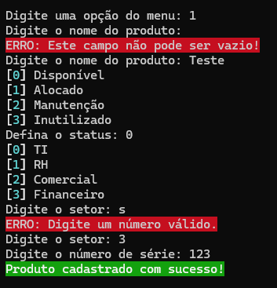

# ⚙️ Sistema de Gestão de Ativos - Python

> Sistema via terminal para gerenciamento de ativos com dashboard interativo utilizando Streamlit.


---

## 📌 Sobre o Projeto

Este é um sistema de gestão de ativos de TI desenvolvido em Python, com interface de terminal estilizada utilizando Rich e dashboard visual simples com Streamlit. Permite cadastrar, listar, buscar, editar e remover ativos corporativos, com armazenamento em arquivo JSON e registro de logs automático utilizando o módulo Logging.

Projeto desenvolvido como exercício prático de lógica, estruturação de código e uso de bibliotecas Python.

---

## 🚀 Funcionalidades

- ✅ Cadastro de ativos com validação de campos
- ✅ Listagem completa de ativos
- ✅ Busca por ID
- ✅ Edição de ativos existentes
- ✅ Exclusão com confirmação
- ✅ Dashboard interativo com gráficos (Streamlit + Pandas)
- ✅ Registro de logs com data e hora
- ✅ Armazenamento de dados em JSON

---

## 🛠️ Tecnologias Utilizadas

| Tecnologia | Uso |
|---|---|
| Python 3.12 | Linguagem principal |
| Rich | Interface estilizada no terminal |
| Streamlit | Dashboard visual no navegador |
| Pandas | Manipulação de dados para relatórios |
| Logging | Registro de logs do sistema |
| JSON | Armazenamento de dados |

---

## 📁 Estrutura do Projeto

```
sistema-gestao-ativos/
│
├── base/
│   ├── ativos.json         # Base de dados
│   └── logs.log            # Registro de logs
│
├── modulos/
│   ├── crud.py             # Funções principais
│   └── validacoes.py       # Validações de entrada
│
├── relatorios/
│   └── streamlit.py        # Dashboard interativo
│
├── main.py                 # Arquivo de inicialização
└── requirements.txt
```

---

## ⚙️ Como Executar

**1. Clone o repositório**
```bash
git clone https://github.com/jhonattanromao/sistema-gestao-ativos.git
cd sistema-gestao-ativos
```

**2. Instale as dependências**
```bash
pip install -r requirements.txt
```

**3. Execute o programa**
```bash
python main.py
```

> O dashboard abre automaticamente no navegador ao selecionar a opção **[6] Abrir Dashboard** no menu.

---

## 📷 Preview

<table>
  <tr>
    <td align="center">Menu Principal</td>
    <td align="center">Dashboard</td>
    <td align="center">Listagem</td>
    <td align="center">Validações</td>
  </tr>
  <tr>
    <td></td>
    <td></td>
    <td></td>
    <td></td>
  </tr>
</table>

---

## 👨‍💻 Autor

Desenvolvido por **Jhonattan Romao**  
[](https://github.com/jhonattanromao)